# IBM iAgentX

**Bring your IBM i system into VS Code AI agents — GitHub Copilot Chat, Claude Code, and IBM Bob.**

IBM iAgentX exposes IBM i resources (source members, IFS files, SQL, job logs, CL commands)
to AI coding agents via the Model Context Protocol (MCP). It reuses the active SSH connection
managed by [Code for IBM i](https://marketplace.visualstudio.com/items?itemName=halcyontechltd.code-for-ibmi)
— no second connection, no extra credentials.

---

## See It In Action

### Your AI is brilliant. Just completely blind to IBM i.


### IBM iAgentX — Bring AI Intelligence to Your IBM i


### The Challenge — Why AI can't help IBM i developers
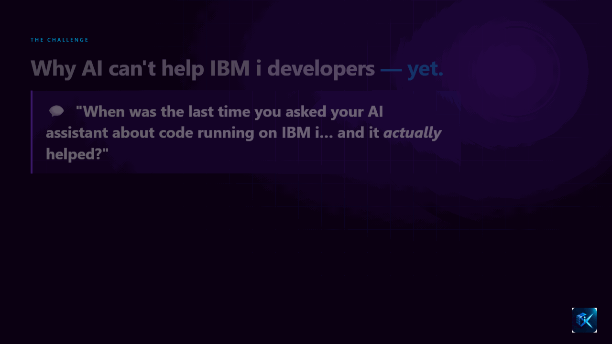

### Market Gap — How do the options stack up?
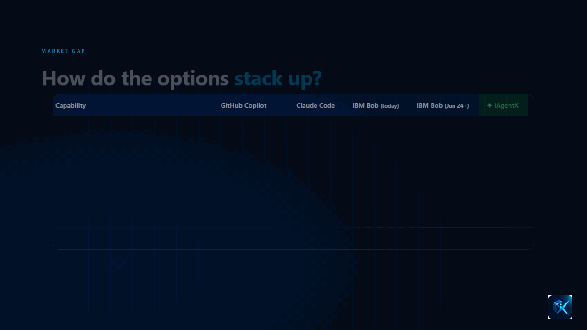

### The Solution — Meet IBM iAgentX
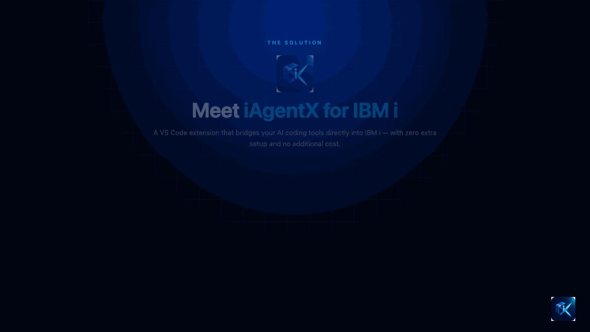

### Architecture — How it all connects
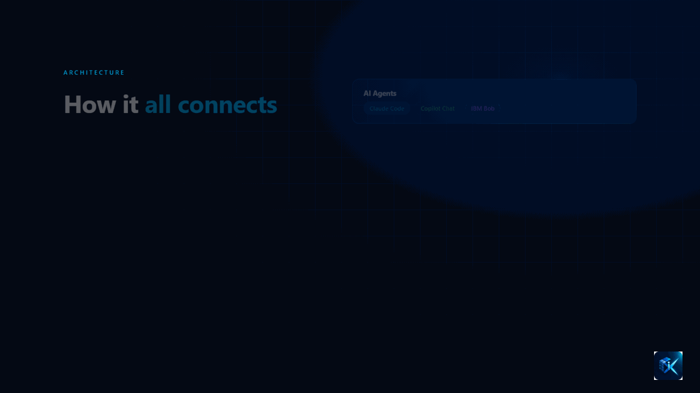

### Security — Built-in, not bolted-on
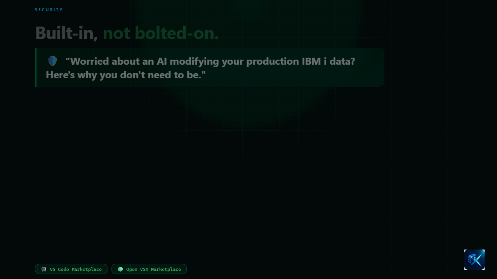

### Capabilities — 29 IBM i Tools
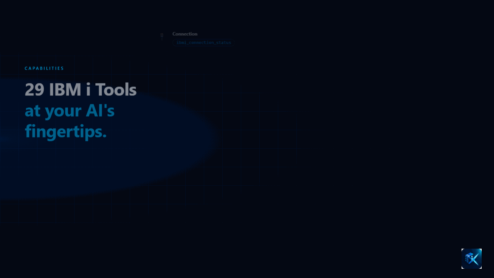

### Demo 1 — Diagnose a job stuck in MSGW
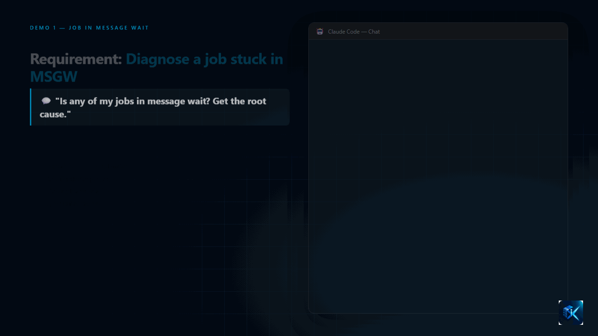

### Demo 2 — Cross-table row count analysis
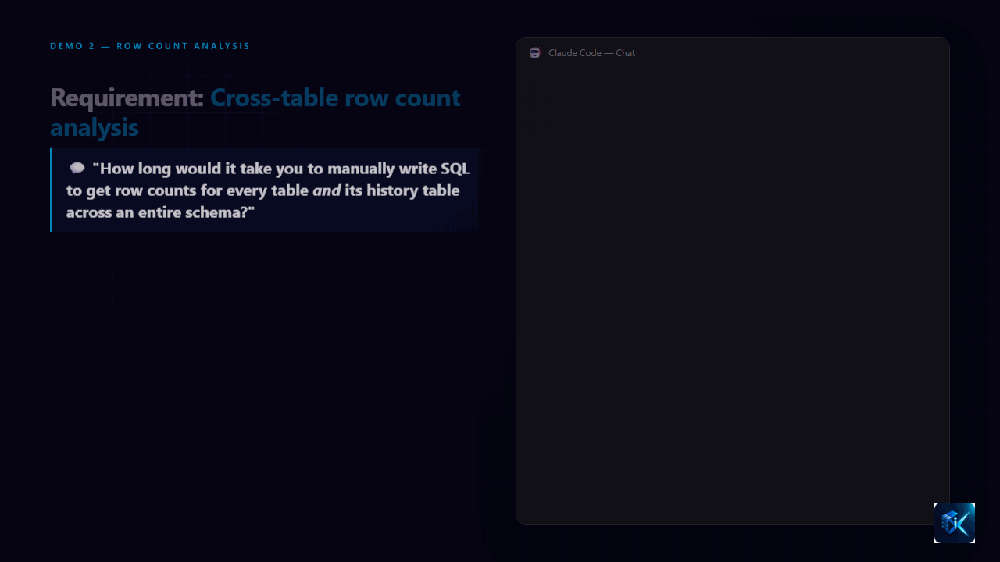

### Demo 3 — Debug & fix a SQL table function
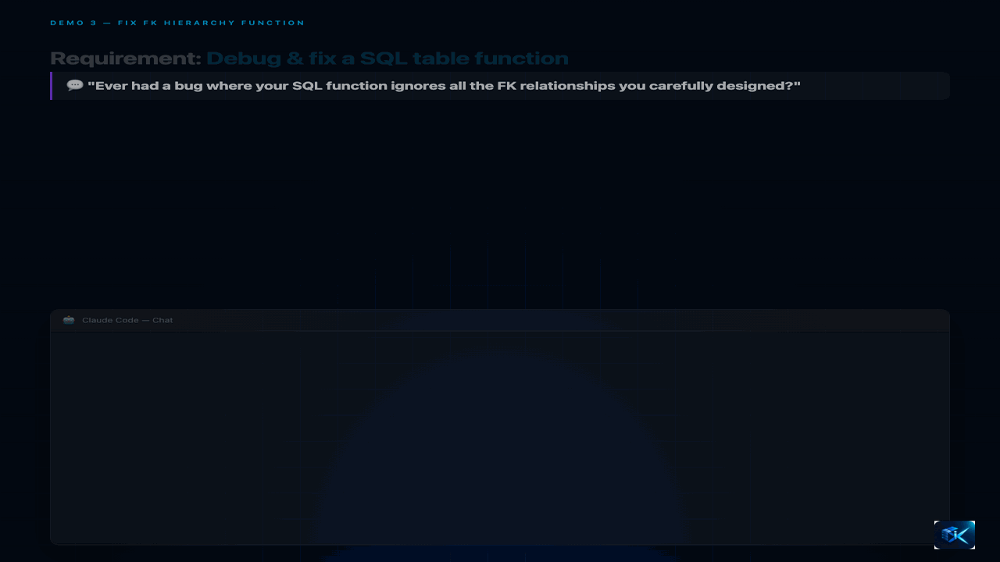

### Impact — Before & After iAgentX
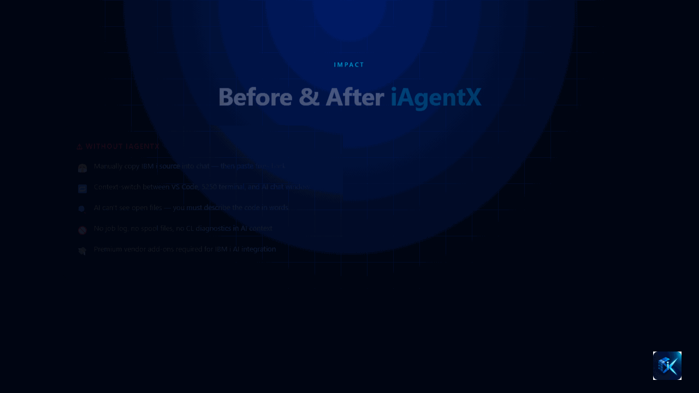

### Get Started — Up and running in 3 steps
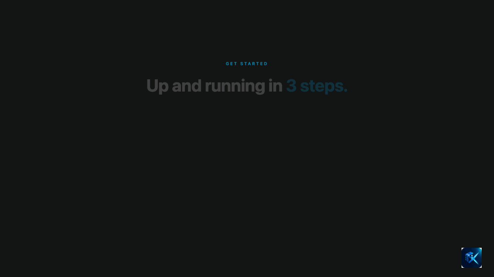

---

## What you can do

Ask your AI agent to:

- Read and review source members (RPG, CL, COBOL, DDS, …)
- **Search across source members** — find any string or symbol across a whole source physical file
- Edit open source members directly from the AI agent — surgical single-line replacements or full updates
- Browse IFS files and directories; **search IFS trees recursively** by text content and filename pattern
- Query DB2 for i with plain SQL
- Explore objects in a library — list by type, check existence, read data area values, inspect file fields
- Inspect **program and service program details** — ILE attributes, activation group, bound modules
- Pull job log messages by job ID — works for active and ended jobs alike; **look up CPFxxxx message text** from any message file
- Retrieve spool file content (QPJOBLOG and others) from any job; **browse spool files on a named output queue**
- Search for jobs by name pattern, user, subsystem, and status; **list user profiles** with status and last signon
- Run read-only CL commands (DSPFD, WRKACTJOB, …)

Everything happens through the existing Code for IBM i SSH session.

---

## Requirements

- VS Code 1.99 or later
- [Code for IBM i](https://marketplace.visualstudio.com/items?itemName=halcyontechltd.code-for-ibmi) — installed and connected to an IBM i system
- One or more of the supported AI agents:
  - [Claude Code CLI](https://docs.anthropic.com/en/docs/claude-code)
  - [Claude Code VS Code extension](https://marketplace.visualstudio.com/items?itemName=anthropic.claude-code)
  - GitHub Copilot Chat (built into VS Code)
  - IBM Bob

---

## Installation

Install from the Marketplace or via the command line:

```bash
code --install-extension Duvaragesh.ibm-iagentx
```

No manual configuration required — the extension auto-configures Claude Code and VS Code
on first activation.

> **Tip — enable auto-updates:** IBM iAgentX is updated frequently with new tools and improvements.
> In VS Code, go to **Extensions** → right-click **IBM iAgentX** → **Enable Auto Update**
> to always stay on the latest version without manual action.

---

## Setup

### Claude Code

On first activation the extension writes its MCP server URL into `~/.claude.json`
automatically. Start a new Claude Code session and the IBM i tools are ready.

### GitHub Copilot Chat

The extension registers itself via VS Code's MCP provider API and writes to
`%APPDATA%/Code/User/mcp.json` (Windows) or the platform equivalent.
Copilot Chat picks this up without any manual steps.

### IBM Bob

IBM iAgentX auto-configures IBM Bob by writing to its MCP settings file. Set the
`ibm-iagentx.bobAppDataFolder` setting to the app data folder name Bob uses on your machine
(e.g. `IBMBob`) — leave it blank to skip Bob configuration.

The file updated is:

```
%APPDATA%\<bobAppDataFolder>\User\globalStorage\saoudrizwan.claude-dev\settings\cline_mcp_settings.json
```

For example, with `bobAppDataFolder` set to `IBMBob`:

```
%APPDATA%\IBMBob\User\globalStorage\saoudrizwan.claude-dev\settings\cline_mcp_settings.json
```

The extension only updates this file if it already exists — confirming Bob is installed before writing.

---

## Available Tools

**Connection & status**

| Tool | Description |
|---|---|
| `ibmi_connection_status` | Check connection status and IBM i OS version |

**Source members & libraries**

| Tool | Description |
|---|---|
| `ibmi_get_source_member` | Read the full source of a library/SPF/member |
| `ibmi_list_source_members` | List members in a source physical file |
| `ibmi_list_source_files` | List all source physical files in a library |
| `ibmi_search_source_members` | Full-text search across all members in a source physical file |
| `ibmi_list_objects` | List objects in a library by type and name filter |
| `ibmi_get_object_info` | Detailed attributes of an object (owner, size, timestamps) |
| `ibmi_check_object` | Check whether an object exists — lightweight existence guard |
| `ibmi_get_program_info` | Program / service program attributes and bound module list |
| `ibmi_get_file_fields` | Field definitions for a physical or logical file |
| `ibmi_get_library_list` | Current library list with type and position |

**IFS**

| Tool | Description |
|---|---|
| `ibmi_get_ifs_file` | Read a file from the IFS (EBCDIC-aware) |
| `ibmi_list_ifs_directory` | List contents of an IFS directory |
| `ibmi_search_ifs` | Recursive text search across an IFS directory tree |

**SQL & data**

| Tool | Description |
|---|---|
| `ibmi_run_sql` | Run a read-only SQL SELECT query against DB2 for i |
| `ibmi_get_data_area` | Read the current value and attributes of a data area |

**Jobs, spool & diagnostics**

| Tool | Description |
|---|---|
| `ibmi_get_job_log` | Retrieve job log messages with severity and type filtering |
| `ibmi_find_jobs` | Search for jobs by name pattern, user, subsystem, and status |
| `ibmi_list_spool_files` | List spool file metadata for a job or user |
| `ibmi_get_spool_file` | Retrieve spool file content with optional line range |
| `ibmi_get_output_queue_info` | List spool files on a named output queue |
| `ibmi_run_cl_command` | Run a read-only CL command; CPYSPLF to `/tmp/` also permitted |

**Users**

| Tool | Description |
|---|---|
| `ibmi_list_user_profiles` | List user profiles with status, class, and last sign-on |

**Messages**

| Tool | Description |
|---|---|
| `ibmi_get_message_description` | Look up message text and second-level help for CPFxxxx / MCHxxxx / SQLxxxx codes |

**Editor (VS Code)**

| Tool | Description |
|---|---|
| `ibmi_get_active_editor` | Read the content and metadata of the currently open editor |
| `ibmi_list_open_editors` | List all visible editor tabs with URI and member info |
| `ibmi_update_active_editor` | Replace the full content of the active editor and save |
| `ibmi_update_editor_by_uri` | Replace the full content of a specific open editor by URI |
| `ibmi_replace_in_active_editor` | Surgical find-and-replace in the active editor — no full-file rewrite needed |

---

## Settings

| Setting | Default | Description |
|---|---|---|
| `ibm-iagentx.preferredPort` | `41927` | HTTP port for the iAgentX server; falls back to next 4 ports if busy |
| `ibm-iagentx.sqlMaxRows` | `100` | Default max rows returned by `ibmi_run_sql` (1–1000) |
| `ibm-iagentx.clAllowedPrefixes` | `["DSP","LST","WRK","CHK","PRT","DMP","RTV","QRY"]` | CL verb prefixes permitted by `ibmi_run_cl_command` |
| `ibm-iagentx.bobAppDataFolder` | `""` | App data folder name used by IBM Bob (e.g. `IBMBob`). Leave blank to skip Bob auto-configuration |

---

## Status Bar

The status bar item reflects the live state of both the iAgentX server and the IBM i connection.

| Display | Meaning |
|---|---|
| `⟳ iAgentX` | Server is starting |
| `✓ iAgentX :41927` | Running — IBM i connected |
| `✓ iAgentX :41927 (shared)` | Another VS Code window owns the server — this window is reusing it |
| `⚠ iAgentX :41927` | Server running but IBM i is disconnected — IBM i tools unavailable, editor tools still work |
| `⊘ iAgentX` | Server manually stopped |
| `✗ iAgentX` | Failed to start |

**Click the status bar item** to open the management menu:

- **Start iAgentX server** — start the server after a manual stop
- **Stop iAgentX server** — shut down the server
- **Restart iAgentX server** — stop and restart (useful after a port conflict)
- **Refresh iAgentX config** — re-write `~/.claude.json` and `mcp.json` with the current port

The command is also available from the Command Palette as **IBM iAgentX: Manage MCP Server**.

### Multiple VS Code Windows

Only one iAgentX server runs at a time. When you open a second VS Code window, it detects the
existing server on port 41927 and enters shared mode — the status bar shows `(shared)` and the
second window's AI tools route through the same server. No extra ports are used.

---

## Security

- All 29 tools are **read-only** — no write, delete, or compile operations
- Editor tools (`ibmi_update_*`, `ibmi_replace_*`) only modify files **open in the editor** — no blind remote writes
- `ibmi_run_sql` only accepts SELECT, WITH (CTEs), and VALUES statements
- `ibmi_run_cl_command` enforces a configurable verb-prefix allowlist; CPYSPLF is only permitted with `TOFILE(*TOSTMF)` and a destination under `/tmp/`
- `ibmi_get_spool_file` copies to a temp path under `/tmp/` and deletes after reading
- No credentials stored — piggybacks on Code for IBM i's SSH session
- iAgentX server binds to loopback (`127.0.0.1`) only — never reachable from outside your machine

---

## Troubleshooting

**Claude Code doesn't see the IBM i tools**
1. Check the status bar — must show `✓ iAgentX :NNNNN`
2. Click the status bar item → **Refresh iAgentX config**
3. Start a new Claude Code session

**`No active IBM i connection` error**
Open Code for IBM i and connect: `Ctrl+Shift+P` → `IBM i: Connect`

**Status bar shows `⚠ iAgentX`**
IBM i is disconnected. VS Code editor tools still work. Reconnect via Code for IBM i and the
icon will return to `✓` automatically.

**Port changed between restarts**
Click the status bar item → **Refresh iAgentX config**, then restart Claude Code.

---

## Development

### Testing overview

There are two independent test layers:

| Layer | Framework | Needs IBM i? | Command |
|---|---|---|---|
| Unit | Vitest | No | `npm test` |
| Integration | Mocha via `@vscode/test-cli` | Yes | `npm run test:int` |

---

### Unit tests

All IBM i and VS Code APIs are mocked — runs instantly in Node.js with no live system.

**Run once:**
```bash
npm test
```

**Watch mode** (re-runs on file save during development):
```bash
npm run test:watch
```

**Coverage report** (generates `coverage/index.html`):
```bash
npm run test:coverage
```

Unit tests cover all 28 tools plus utilities — 124 tests across 30 files.

---

### Integration tests

Integration tests run **inside a real VS Code extension host** using [`@vscode/test-cli`](https://github.com/microsoft/vscode-test-cli) with Mocha. This gives access to the real `vscode` API and the live IBM i connection managed by Code for IBM i.

**Prerequisites:**
- VS Code installed
- Code for IBM i extension installed and connected to an IBM i system
- Run the command from a terminal where VS Code is accessible on `PATH`

**Run:**
```bash
npm run test:int
```

This does two things:
1. Compiles the integration tests (`tsc -p tsconfig.int.json`)
2. Launches a headless VS Code instance, activates the extension, and runs the Mocha suites against the real IBM i system

**What is tested:**
- `connectionStatus` — verifies host, user, and OS version from a live connection
- `runSql` — executes a real SELECT against `QSYS2.LIBRARY_LIST_INFO`; verifies DML is blocked
- `getLibraryList` — confirms `QSYS` appears in the real library list
- `listSourceFiles` — lists source files in `QSYS`
- `runSql` pagination — verifies `maxRows` and `offset` work against real data

---

### Publish gate

`npm run package` and `npm run publish` both run `npm test` (unit tests) first. Integration tests are a separate manual step — run them before cutting a release when an IBM i system is available.

---

### Test structure

```
src/tests/
├── __mocks__/           # Shared vscode + ibmiConnection stubs (used by unit tests)
├── utils/               # parseEditorUri, ccsidCast, qsysPath
├── tools/
│   ├── source/          # getSourceMember, listSourceMembers, listSourceFiles, searchSourceMembers
│   ├── ifs/             # getIfsFile, listIfsDirectory, searchIfs
│   ├── sql/             # runSql, getFileFields, getLibraryList
│   ├── jobs/            # findJobs, getJobLog, getSpoolFile, listSpoolFiles
│   ├── objects/         # listObjects, getObjectInfo, checkObject, getDataArea, getProgramInfo, getOutputQueueInfo
│   ├── admin/           # listUserProfiles, getMessageDescription
│   ├── editor/          # getActiveEditor, listOpenEditors, updateActiveEditor, updateEditorByUri
│   └── connection/      # connectionStatus
└── integration/         # Mocha suites — run via @vscode/test-cli against live IBM i
```

---

## License

MIT — [GitHub: Duvaragesh/ibm-iagentx](https://github.com/Duvaragesh/ibm-iagentx)
